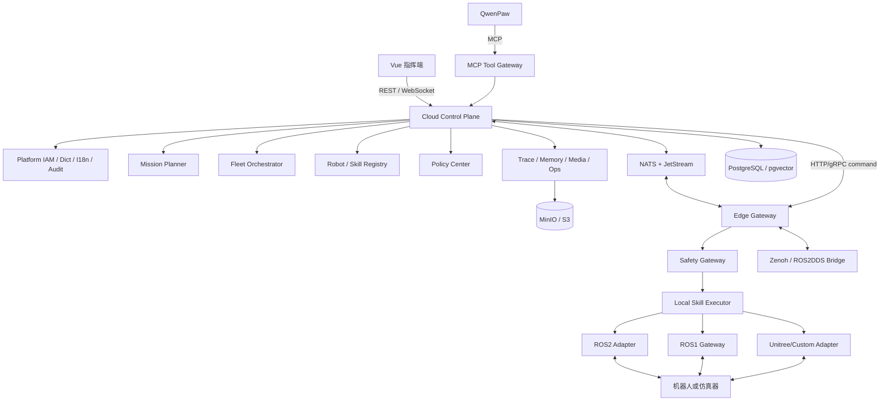

# 一脑多控平台 AI 开发约束与平台公共能力规范 V1.0

| 属性 | 内容 |
| --- | --- |
| 文档状态 | 强制执行（Mandatory） |
| 适用对象 | Codex、TRAE、其他 AI 编程 IDE、人工开发者、测试与运维人员 |
| 基线日期 | 2026-07-03 |
| 上游设计 | [一脑多控平台详细设计说明书 V1.0](./一脑多控平台详细设计说明书%20V1.0.pdf) |
| 架构决策 | [ADR-0001：统一技术基线与前端主栈](./adr/ADR-0001-统一技术基线与前端主栈.md) |
| 实施蓝图 | [平台功能与数据状态统一实施蓝图 V1.0](./平台功能与数据状态统一实施蓝图%20V1.0.md) |
| 功能清单 | [`implementation/platform-feature-manifest.yaml`](./implementation/platform-feature-manifest.yaml) |
| 目标 | 让任何开发主体都能按同一架构完成环境搭建、开发、测试、运行、部署和验收，并形成任务执行、审计、记忆与改进闭环 |

## 1. 文档使用规则

### 1.1 约束级别

本文使用以下关键词：

- **必须（MUST）**：不可绕过。无法满足时必须停止实现，记录 ADR，并由项目负责人批准。
- **禁止（MUST NOT）**：任何代码、配置、提示词或运维操作都不得违反。
- **应该（SHOULD）**：默认执行；偏离时必须在变更说明中解释原因。
- **可以（MAY）**：允许选择，但不得破坏其他强制约束。

### 1.2 事实源与冲突优先级

1. 用户对当前任务的明确要求优先。
2. 人身、设备和数据安全约束优先于功能和交付速度。
3. `contracts/` 下已发布的版本化契约优先于实现代码。
4. 本文定义工程和安全规则；实施蓝图定义前端功能、后端用例和数据状态；机器清单定义功能制品映射。
5. 本文和实施蓝图优先于模块 README 和代码中的历史做法。
6. PDF 设计说明书描述业务目标；本文与实施蓝图负责把目标收敛为可执行规则。
7. 已接受 ADR 负责解决事实源之间的显式冲突；ADR-0001 已取代 PDF 第 4、15 节的多候选技术组合。
8. 代码与规范冲突时，不得默默迎合旧代码。应先判断是代码缺陷还是规范需要 ADR 变更。
9. 根目录 `AGENTS.md` 和 `.trae/rules/project_rules.md` 是入口摘要，不是独立事实源。

### 1.3 AI 开始任务前的必读顺序

1. 根目录 `AGENTS.md`。
2. 本文。
3. `平台功能与数据状态统一实施蓝图 V1.0.md`。
4. `implementation/platform-feature-manifest.yaml` 中当前功能 ID 的完整映射。
5. 与任务相关的 `contracts/` 契约。
6. 对应模块的 `README.md`、ADR、数据库迁移和测试。
7. 必要时查阅上游 PDF；不得仅凭模型记忆推断 ROSClaw、QwenPaw、ROS、MCP 或设备 SDK 的接口。

### 1.4 变更本文

- 架构边界、技术栈、数据所有权、权限模型、状态机、安全链路和公共能力只能通过 ADR 修改。
- ADR 至少包含：背景、决策、替代方案、兼容/迁移影响、安全影响、回滚方案和批准人。
- 文案澄清可直接修改；改变行为语义则必须 ADR。

## 2. 平台目标、边界和不可违背原则

### 2.1 平台目标

平台面向多型号机器狗、轮式机器人和仿真机器人，构建：

> 云端任务规划与多机调度 + QwenPaw Agent Runtime + MCP/Skill 工具体系 + ROSClaw Edge Runtime + 多协议适配 + Safety Gateway + Trace/Memory 闭环。

完整业务闭环必须是：

```text
用户指令/任务模板
  -> 身份与权限校验
  -> QwenPaw 意图理解
  -> Mission Planner 生成结构化 DAG
  -> Policy Center 做任务级校验/审批
  -> Fleet Orchestrator 选择并锁定机器人
  -> 云边可靠下发
  -> Edge Safety Gateway 做动作级校验
  -> Local Skill Executor 调用适配器
  -> 机器人/仿真器执行
  -> 遥测、媒体、事件和审计回传
  -> Trace 回放与结果归档
  -> Memory/Failure Case 沉淀
  -> 经仿真和审批后优化策略或技能
```

### 2.2 系统责任边界

| 层级 | 必须负责 | 禁止负责 |
| --- | --- | --- |
| 云中心 | 身份、任务理解、DAG、审批、全局调度、策略分发、平台数据、审计、记忆和运维 | 闭环实时底层运动控制 |
| QwenPaw | 自然语言理解、受控工具调用、规划建议 | 绕过任务规划/策略/安全网关直接控制机器人 |
| 边缘网关 | 能力适配、动作级安全、本地执行、急停、断网降级、缓存和回传 | 在无授权计划时自行扩大任务范围 |
| 机器人本体 | 实时控制、传感器采集、本体保护和状态反馈 | 解释自然语言或承担平台权限决策 |
| Trace/Memory | 证据记录、回放、失败经验和检索 | 未验证即自动修改生产策略/技能 |

### 2.3 十二条红线

1. 大模型和云服务禁止直接发布 `/cmd_vel`、关节轨迹、低级电机、原始 UDP/SDK 控制指令。
2. 所有物理动作必须是已注册、已版本化的 Skill/Capability，并经过边缘 Safety Gateway。
3. 边缘安全判定是动作执行的最终权威；云端 `ALLOW` 不能覆盖边缘 `BLOCK` 或急停。
4. 本地急停不能依赖云端、Agent、数据库、NATS、Zenoh 或公网可用。
5. Agent 输出只能作为不可信提案；必须经过 Schema、状态机、权限、资源和安全策略的确定性校验。
6. 用户/角色/权限、数据字典、国际化、配置、审计、错误模型、幂等和对象存储元数据必须使用平台公共能力，业务模块不得重复实现。
7. 服务之间禁止直接读写其他领域的表；跨域通过应用接口或版本化事件协作。
8. API、事件、MCP Tool、gRPC 和 Skill 参数必须契约先行，禁止先写实现再临时拼字段。
9. 任务、工具调用、安全决策、人工干预和真实动作必须能通过 `trace_id` 关联并回放。
10. 禁止使用 `latest` 镜像、浮动依赖、未锁定 Git 分支或未记录版本的外部 API。
11. 禁止把密钥、令牌、证书、真实设备地址、用户隐私或生产数据提交到仓库和测试快照。
12. 未通过仿真和安全测试的运动类变更禁止连接真实机器人。

## 3. 统一技术基线

用户指定的选型已由 [ADR-0001](./adr/ADR-0001-统一技术基线与前端主栈.md) 固化，并高于 PDF 中的候选项。项目不得继续把 Go、Kafka、RabbitMQ、Prometheus、Elasticsearch、Milvus 等候选项并列实现。机器可校验的编码值位于清单顶层 `architecture`；修改表格和清单编码必须与新 ADR 同一变更完成。

| 层级 | 项目基线 | 强制约束 |
| --- | --- | --- |
| 云端管理后端 | Java 21、Spring Boot 3.x、MyBatis-Plus、Maven Wrapper | 设备、任务、技能、策略、权限、审计等管理类能力使用 Java |
| Agent/机器人适配服务 | Python 3.12、`uv`、Pydantic、pytest；HTTP 服务默认 FastAPI | 仅承载 QwenPaw Provider、MCP 服务、机器人/仿真适配和确有必要的数据处理 |
| Web 前端 | Vue 3、TypeScript、Vite、Vue Router、Pinia、WebSocket | 本项目统一采用 Vue；引入 React 必须 ADR，禁止双栈复制页面 |
| Agent Runtime | QwenPaw | 必须经 `AgentRuntimeProvider` 适配，禁止业务代码依赖 QwenPaw 内部实现 |
| Agent 工具 | MCP 优先，HTTP/gRPC 辅助 | MCP Tool 只暴露高层平台能力，不能暴露底层 ROS/SDK |
| 边缘运行时 | ROSClaw Edge Runtime | 稳定能力可直接集成；实验/研究能力必须特性开关、版本锁定和降级路径 |
| ROS2 | ROS2 DDS / rosbridge / Zenoh；Ubuntu 24.04 + ROS 2 Jazzy 为兼容基线 | ROS2 为主路径；升级发行版必须验证设备厂商、仿真器和桥接兼容性 |
| ROS1 | ros1_bridge / rosbridge_suite / 自研 ROS1 Gateway | 只作为隔离兼容层；禁止云端领域模型依赖 ROS1 topic/message |
| 弱网 | Zenoh、ROS2DDS bridge | 用于边缘分布式通信和 DDS 桥接；不能替代任务幂等和持久事件 |
| 关系/时序数据 | PostgreSQL；TimescaleDB 可选扩展 | 业务真相保存在 PostgreSQL；高频遥测达到阈值后启用 TimescaleDB |
| 向量 | pgvector | 与 PostgreSQL 同源管理任务记忆、失败案例和场景语义向量 |
| 对象存储 | MinIO / S3 | 数据库只保存元数据、摘要和对象键，不存大文件二进制 |
| 消息 | NATS + JetStream | 承载任务、状态、告警和 Trace 事件；交付语义按至少一次设计 |
| 指标 | vmagent + VictoriaMetrics + Grafana | 应用暴露兼容指标，vmagent 采集，VictoriaMetrics 存储 |
| 日志 | Vector + Loki | 运行日志进 Loki；关键审计必须同时落 PostgreSQL 审计表 |
| 告警 | Grafana Alerting；必要时自研告警服务 | 告警规则版本化；通知失败不能丢失原始告警事件 |
| 可观测链路 | OpenTelemetry、统一 `trace_id` | HTTP、MCP、NATS、gRPC、WebSocket 和边缘事件传播上下文 |

“Vue / React”在本项目中解释为 Vue 3 是唯一默认产品主栈，React 只允许作为有退出计划的隔离兼容例外；它不授权为同一页面、Store、路由或业务流程建设两套实现。

### 3.1 暂不作为基线的组件

- Redis 不是默认必需依赖。只有存在已测量的缓存、分布式限流或短期状态需求时才可通过 ADR 引入。
- Kubernetes 是生产部署目标，但本地开发必须先由 Docker Compose 完整运行。
- TimescaleDB 是可选扩展；未达到遥测规模阈值时使用 PostgreSQL 分区表，避免双实现。
- ROSClaw 的 Physical Memory、Capability Routing、Runtime Intervention 和 Skill Evolution 若上游仍标注为 Experimental/Research，必须默认关闭。

### 3.2 版本锁定

- JDK 固定主版本 21；Maven 使用仓库中的 Maven Wrapper。
- Python 版本由 `.python-version` 固定，依赖由 `uv.lock` 锁定。
- Node 版本由 `.nvmrc` 或 `.node-version` 固定，包管理器和版本写入根 `package.json`，依赖使用 `pnpm-lock.yaml`。
- 容器镜像固定版本，并在发布环境固定 digest；禁止 `latest`。
- ROSClaw、QwenPaw、ROS bridge、设备 SDK 必须记录：版本、来源、许可证、校验值、已验证硬件/系统和升级回滚步骤。
- 上述外部组件先在机器清单 `external_contracts` 登记；消费者功能进入 `IN_PROGRESS` 前必须改为 `PINNED`，并让 `locked_reference` 指向仓库内非空的官方契约快照/适配说明。
- 版本号的唯一事实源是仓库清单和锁文件，本文不维护易过期的补丁版本。

## 4. 目标架构与部署单元

### 4.1 逻辑架构



### 4.2 模块化单体优先

PDF 中的各中心是**逻辑边界**，不等于第一天就拆成独立微服务。云端 V1 默认采用 Java 模块化单体：

- `platform-common`：公共技术基础，不承载业务规则。
- `platform-iam`：用户、组织、角色、权限和认证。
- `platform-governance`：字典、国际化、配置、审计和幂等。
- `robot-registry`、`skill-registry`、`mission`、`fleet`、`policy`、`trace`、`memory`、`map-scene`、`media`、`ops`：领域模块。
- 模块只通过公开应用接口和领域事件协作，禁止跨模块 Mapper 和跨模块表查询。
- 当独立扩缩容、故障隔离、团队边界或性能数据证明有必要时，才把模块拆为服务。

Python 的 Agent/MCP 和边缘进程是天然独立部署单元，不并入 Java 单体。

### 4.3 依赖方向

每个后端领域模块采用端口/适配器结构：

```text
interfaces (REST/NATS/MCP/gRPC)
        -> application (use cases / transactions)
        -> domain (entities / policies / state machines)
        <- infrastructure (MyBatis / NATS / S3 / external adapters)
```

- `domain` 禁止依赖 Spring MVC、MyBatis、NATS、S3、ROS 或具体 QwenPaw SDK。
- `application` 负责用例编排和事务边界，禁止放 SQL 和协议细节。
- `infrastructure` 实现端口，不反向定义业务语义。
- Controller/MCP Handler 禁止直接调用 Mapper。

## 5. 规范化仓库结构

平台脚手架必须收敛到以下结构；新增顶级目录需要 ADR：

```text
opengeobot/
├── AGENTS.md
├── README.md
├── pom.xml
├── package.json
├── pnpm-workspace.yaml
├── .python-version
├── .env.example
├── apps/
│   ├── cloud-control/             # Java 21 模块化云控制面
│   └── web-console/               # Vue 3 指挥端
├── services/
│   ├── agent-runtime/             # QwenPaw Provider/规划适配
│   └── mcp-tool-gateway/          # 平台 MCP Server
├── edge/
│   ├── edge-gateway/
│   ├── safety-gateway/
│   ├── local-skill-executor/
│   └── adapters/
│       ├── ros2/
│       ├── ros1/
│       ├── unitree/
│       ├── custom/
│       └── simulation/
├── contracts/
│   ├── openapi/
│   ├── asyncapi/
│   ├── mcp/
│   ├── protobuf/
│   ├── skills/
│   └── capabilities/
├── deploy/
│   ├── compose/
│   ├── kubernetes/
│   └── observability/
├── scripts/
│   ├── dev.ps1
│   └── dev.sh
├── tests/
│   ├── contract/
│   ├── integration/
│   ├── e2e/
│   ├── simulation/
│   └── fixtures/
└── docs/
    ├── adr/
    ├── implementation/
    ├── runbooks/
    ├── test-plans/
    ├── 平台功能与数据状态统一实施蓝图 V1.0.md
    └── 一脑多控平台详细设计说明书 V1.0.pdf
```

规则：

- 契约、生成器输入和数据库迁移必须纳入版本控制。
- 生成代码必须放在明确的 `generated/` 目录，文件头标记生成来源；不得手改。
- 测试 fixture 不得包含生产数据或真实密钥。
- 每个可运行模块必须有 README，写明职责、依赖、启动、测试、健康检查和故障排查。

## 6. 平台公共能力统一设计

### 6.1 公共能力边界

机器清单顶层 `platform_capabilities` 是公共能力唯一归属的可执行索引，`platform_capability_profiles` 是功能复用集合。每个功能必须声明一个 profile；`requires_edge_safety: true` 的功能所用 profile 必须包含 `SAFETY_ENFORCEMENT`。业务模块不能通过修改 profile 名称规避公共能力。

以下能力只允许由平台公共模块提供，业务域通过公共应用接口使用：

| 公共能力 | 唯一归属 | 业务模块允许做什么 | 业务模块禁止做什么 |
| --- | --- | --- | --- |
| 用户/组织 | `platform-iam` | 引用 `user_id`、查询当前主体 | 自建业务用户表、复制用户资料 |
| 角色/权限 | `platform-iam` | 声明权限码、调用鉴权 | Controller 中硬编码角色名 |
| 数据字典 | `platform-governance` | 声明字典类型、读取字典项 | 为同一概念自建重复枚举表 |
| 国际化 | `platform-governance` + 前端 i18n | 使用稳定消息键 | 后端返回需展示的硬编码中文 |
| 参数配置 | `platform-governance` | 声明类型化配置项 | 运行时从任意表/环境拼接业务配置 |
| 审计 | `platform-governance` | 提交结构化审计事件 | 只写普通日志代替审计 |
| 幂等 | `platform-governance` | 对命令型接口声明幂等键 | 用进程内缓存假装幂等 |
| 错误/分页/时间/ID | `platform-common` | 复用统一模型 | 每个模块自创响应包装 |
| 对象存储元数据 | `media` 公共端口 | 关联 `asset_id` | 在业务表存文件路径或大二进制 |
| 事件发布 | 公共 Outbox 基础设施 | 发布版本化领域事件 | 事务提交前直接发 NATS 后假定成功 |

### 6.2 用户、组织和身份认证

#### 6.2.1 数据模型

最少包含：

- `sys_user`：登录名、显示名、状态、语言、时区、凭据状态；密码摘要与用户资料分离。
- `sys_org`：组织/部门树；V1 是单平台组织模型，不擅自实现多租户计费。
- `sys_user_org`：用户与组织关系、主组织。
- `sys_role`：角色元数据和数据范围。
- `sys_permission`：不可变权限码、资源类型、动作和风险级别。
- `sys_user_role`、`sys_role_permission`：授权关系，带生效/失效时间和审计字段。
- `sys_refresh_token` 或等价会话表：只存不可逆摘要、设备信息、过期和撤销状态。

用户状态至少为 `PENDING`、`ACTIVE`、`LOCKED`、`DISABLED`；禁止用自由文本表示。

#### 6.2.2 认证规则

- 人员认证统一由 Spring Security 安全链处理；业务模块不得解析密码或自行签发 Token。
- 密码必须使用经过审查的自适应哈希（默认 Argon2id）；禁止 MD5、SHA 直接哈希和可逆加密。
- Access Token 短时有效；Refresh Token 可轮换、可撤销并检测重放。
- WebSocket 握手必须认证，连接期间权限或会话撤销后应主动断开或拒绝后续订阅。
- 边缘网关和机器人使用机器身份与证书，不得借用人员账户。
- 生产云边通信必须 mTLS；证书应支持轮换、撤销和设备绑定。
- 登录、失败、锁定、登出、Token 刷新、授权变更都必须审计。

#### 6.2.3 权限模型

采用“RBAC + 资源范围 + Policy Center 安全策略”：

```text
是否能发起操作 = Permission(action) AND ResourceScope(resource)
是否允许实际执行 = TaskPolicy AND EdgeSafetyPolicy
```

权限码使用小写点分格式：`<domain>.<resource>.<action>`，例如：

- `platform.user.read`、`platform.user.manage`
- `platform.role.read`、`platform.role.manage`
- `platform.dictionary.manage`、`platform.i18n.manage`
- `robot.robot.read`、`robot.robot.register`、`robot.robot.control`
- `mission.mission.create`、`mission.mission.approve`、`mission.mission.cancel`
- `mission.mission.pause`、`mission.mission.resume`
- `safety.emergency_stop.execute`、`safety.emergency_stop.reset`
- `policy.policy.read`、`policy.policy.publish`
- `trace.trace.read`、`audit.audit.read`

规则：

- 代码检查权限码，不检查 `admin`、`dispatcher` 等角色名称。
- 内置角色只是权限集合，可包含 `PLATFORM_ADMIN`、`DISPATCHER`、`APPROVER`、`OBSERVER`、`AUDITOR`、`MAINTAINER`。
- `PLATFORM_ADMIN` 也不能绕过 Safety Gateway。
- 任务审批人和任务发起人是否允许为同一人由策略配置；高危动作默认职责分离。
- 数据范围至少支持 `ALL`、`ORG_AND_CHILDREN`、`ORG`、`SELF`、`ROBOT_GROUP`、`CUSTOM`。
- 紧急停止和“解除急停”是不同权限；解除急停必须二次确认并审计。

#### 6.2.4 权限声明和测试

- 每个 REST、MCP Tool、WebSocket 订阅、运维动作必须在契约中声明权限码。
- 新权限必须通过迁移/种子数据创建，禁止运行时悄悄插入。
- 每个受保护入口至少测试：未认证 401、无权限 403、范围不匹配 403、授权成功、撤权立即生效。

### 6.3 数据字典

#### 6.3.1 适用范围

字典用于可配置、可展示、可停用的参考数据，例如机器人类型、传感器类型、告警等级展示项。以下内容**禁止**做成可编辑字典：

- Mission、Mission Step、Skill Execution 等状态机状态。
- Safety Gateway 的 `ALLOW/BLOCK/MODIFY/REQUIRE_CONFIRMATION/EMERGENCY_STOP`。
- 事件类型、协议字段、权限码和代码分支依赖的核心枚举。

核心枚举必须在 `contracts/` 定义并生成/校验；字典只提供展示或业务配置。

#### 6.3.2 数据模型

- `sys_dict_type`：`dict_code`、名称键、范围、状态、版本、是否系统内置。
- `sys_dict_item`：稳定 `item_code`、值、排序、状态、颜色/图标等展示元数据、生效区间。
- 字典展示文本使用 `label_i18n_key` 关联国际化资源，禁止每种语言加一列。
- 系统内置字典允许新增翻译和展示属性，但删除/改码必须迁移和兼容评估。

#### 6.3.3 API 与缓存

- 统一读取：`GET /api/v1/platform/dictionaries/{dict_code}/items`。
- 管理接口统一放在 `/api/v1/platform/dictionaries`，受 `platform.dictionary.manage` 保护。
- 返回 `version`/ETag；变更后发布 `platform.dictionary.changed.v1` 事件。
- Java 和前端缓存必须有版本失效机制，禁止永久本地缓存。
- API 和数据库只传稳定 code，展示层再解析本地化 label。

### 6.4 国际化

- 默认语言 `zh-CN`，首个完整备用语言 `en-US`；Locale 使用 BCP 47。
- 后端根据 `Accept-Language` 或用户配置选择语言，但错误响应的稳定依据永远是 `code`/`message_key`。
- REST 错误不得只返回自然语言；至少返回 `code`、`message_key`、`arguments`、`trace_id`。
- 前端源码禁止散落可见中文/英文，必须使用 i18n key；开发模式缺失 key 应报警，CI 检查双语 key 集合。
- 数据库存储业务 code 和 i18n key，不把翻译后的文字当作关联键。
- 用户输入、任务名称、备注等内容数据不自动翻译；机器生成翻译必须标记来源和可审校状态。
- 所有持久化时间使用 UTC `timestamptz`，API 使用 ISO 8601；用户界面按用户时区展示。
- 数字、日期、单位和复数格式使用 Locale API，禁止字符串拼接。

国际化资源分层：

```text
web-console/src/locales/{locale}/platform.json
web-console/src/locales/{locale}/{domain}.json
sys_i18n_resource              # 运行时可配置的字典/业务元数据
```

代码静态文案存 Git；运行时业务元数据存 `sys_i18n_resource`。同一个 key 不得同时被两处定义。

### 6.5 平台参数配置

- `sys_config` 保存非敏感、类型化、可审计的平台配置：`config_key`、类型、Schema、作用域、值、版本。
- 密钥和证书只保存 Secret 引用，不把明文放 `sys_config`。
- 配置分为 `STATIC`（重启生效）和 `DYNAMIC`（事件通知后生效）。
- 动态配置读取失败时使用最后一个已验证版本；安全配置未知或过期时运动命令 fail closed。
- 配置变更必须校验 Schema、记录旧/新值摘要、操作者和原因，并可回滚。

### 6.6 审计、幂等和公共元数据

#### 审计

`sys_operation_audit` 为追加写事实表，至少记录：

- `audit_id`、`occurred_at`、`actor_type`、`actor_id`
- `action`、`resource_type`、`resource_id`
- `result`、`reason_code`、`source_ip`、`user_agent`
- `trace_id`、`request_id`、`mission_id`、`robot_id`
- 变更前后摘要；敏感字段脱敏，禁止保存密码、Token 和原始密钥

安全策略发布、审批、手动接管、急停、解除急停和权限变更必须同步形成审计记录。Loki 日志不能替代审计事实表。

#### 幂等

- 创建任务、审批、任务控制、技能下发、急停和上传完成回调必须支持 `Idempotency-Key` 或等价唯一命令 ID。
- 相同键和相同请求摘要返回首次结果；相同键但请求不同返回 409。
- NATS/Zenoh/边缘消费者使用 `event_id`/`command_id` 去重，处理结果持久化。
- 不承诺“恰好一次”；按“至少一次投递 + 幂等消费”设计。

#### 公共表字段

普通可变业务表统一包含：

```text
id BIGINT                         # 数据库内部主键，不暴露给外部
public_id VARCHAR(64) UNIQUE      # 对外稳定、不透明 ID
created_at TIMESTAMPTZ
created_by VARCHAR(64)
updated_at TIMESTAMPTZ
updated_by VARCHAR(64)
version INTEGER                  # 乐观锁
deleted BOOLEAN                  # 仅适用于允许逻辑删除的主数据
```

- 事件、审计、Trace 和遥测事实表禁止逻辑删除覆盖历史。
- 外部 API 不暴露顺序型内部主键。
- 业务删除语义优先使用状态停用；涉及审计的数据不得物理删除，隐私删除按专门流程匿名化。

## 7. 领域模块约束

### 7.1 Robot Registry

Robot Registry 是机器人身份、型号、网关绑定和能力声明的唯一事实源。

必须维护：

- `robot`、`robot_model`、`robot_capability`、`robot_capability_binding`
- `edge_gateway`、`robot_sensor`、`robot_group`
- 当前地图/区域绑定、维护状态、安全配置引用和证书引用
- Capability Manifest 的版本、摘要、上报时间和校验结果

约束：

- 注册由边缘网关机器身份发起；不能信任上报的 `robot_id`、能力或型号，必须校验证书绑定和 Schema。
- 在线状态由心跳租约计算，不允许前端或普通管理接口直接修改。
- 电量、位姿等实时状态属于状态投影/遥测，不把 `robot` 主表当高频时序表更新。
- 机器人必须声明 Capability，Skill Registry 再声明其能力依赖；调度器只做能力匹配，不写厂商条件分支。
- 机器人维护、故障、急停锁定时不可被调度。
- 网关与机器人一对多关系必须显式；机器人换绑网关需审计和重新握手。

Capability Manifest 至少包含：

```json
{
  "schema_version": "1.0",
  "robot_id": "dog-001",
  "gateway_id": "edge-001",
  "robot_type": "quadruped",
  "vendor": "unitree",
  "model": "go2",
  "ros_version": "ros2",
  "control_protocol": "unitree_sdk",
  "capabilities": [
    {
      "code": "navigation.navigate_to",
      "version": "1.0.0",
      "constraints": {
        "max_speed_mps": 0.6
      }
    }
  ],
  "sensors": ["camera", "imu", "lidar"],
  "manifest_digest": "sha256:..."
}
```

### 7.2 Capability 与 Skill Registry

Capability 是设备能做什么；Skill 是平台如何完成一个可验证任务。二者不得混用。

```text
Capability: navigation.navigate_to@1
Skill: inspection.inspect_area@1.2.0
Skill requires:
  - navigation.navigate_to >=1,<2
  - perception.capture_image >=1,<2
  - safety.obstacle_avoidance >=1,<2
```

每个 Skill 版本必须包含：

- 稳定 `skill_id` 和不可变语义版本。
- 本地化名称/描述键、类别和风险级别。
- JSON Schema 输入/输出。
- 所需 Capability 及版本范围。
- Safety Constraints Schema 和默认约束。
- 支持的机器人类型与适配器要求。
- 执行位置（`EDGE`/`CLOUD`，运动类必须 `EDGE`）。
- 超时、重试、补偿、可暂停性和幂等语义。
- 执行器入口、制品摘要、签名、发布状态和回滚版本。
- 单元、契约、仿真和兼容性测试证据。

发布状态统一为：

```text
DRAFT -> VALIDATING -> APPROVED -> PUBLISHED -> DEPRECATED -> RETIRED
```

- 已发布版本不可原地修改；任何 Schema、约束或执行逻辑变化都发布新版本。
- 失败重试只能用于声明为安全且幂等的步骤；运动命令默认不自动重试。
- 组合 Skill 必须展开为可追踪子步骤，不能隐藏真实动作。
- 技能进化产物必须先进入 `DRAFT`，经回放、仿真、审批后发布，禁止 Memory 直接改生产 Skill。

### 7.3 QwenPaw Agent Runtime

平台只依赖自有稳定端口：

```python
class AgentRuntimeProvider(Protocol):
    async def plan(self, request: PlanRequest) -> PlanProposal: ...
    async def continue_plan(self, request: ContinuePlanRequest) -> PlanProposal: ...
    async def cancel(self, invocation_id: str) -> None: ...
    async def health(self) -> ProviderHealth: ...
```

QwenPaw 实现放在 `services/agent-runtime`，并遵守：

- QwenPaw 版本和配置必须锁定；升级必须跑 Agent 评测集和工具安全回归。
- 平台通过受控 API/Provider 或 MCP 客户端集成，不读取/修改 QwenPaw 内部数据库。
- Prompt、System Instruction、Skill 和 MCP 配置必须版本化，并记录到任务 Trace。
- Agent 输入只包含完成任务所需的最小数据，敏感字段脱敏；禁止把生产凭据放进上下文。
- Agent 输出必须匹配 `contracts/` 中的 `PlanProposal` JSON Schema。
- 输出中的机器人、区域、Skill、参数、依赖和策略引用都必须由 Mission Planner 重新查验。
- 超时、模型不可用或输出非法时返回可解释错误，不能降级为直接执行自然语言。
- Agent 对话记忆与平台的物理任务 Memory 分离；只有经筛选的任务事实可写入 Memory Center。

### 7.3.x QwenPaw 智能体初始化

平台初始化时，agent-runtime 服务通过 QwenPaw 管理 API 在 QwenPaw 中创建一个持久化
智能体（ID: `opengeobot-controller`，名称: "一脑多控"），该智能体绑定平台已注册技能
作为工具，实现任务规划的连续性和上下文感知。

**初始化流程：**

1. agent-runtime 启动时调用 `GET /api/agents/opengeobot-controller` 检查智能体是否存在。
2. 若不存在，调用 `POST /api/agents` 创建智能体：
   - `name`: "一脑多控"
   - `description`: "OpenGeoBot 平台统一任务规划与控制智能体"
   - `skill_names`: 平台已注册技能列表（stand_up, move_forward, stop 等）
   - `workspace_dir`: 专用工作目录
   - `language`: "zh"
3. 若已存在，调用 `PUT /api/agents/opengeobot-controller` 更新 skill_names。
4. QwenPaw 管理 API 不可用时，降级为无状态 `/v1/chat/completions` 模式。

**云端到 agent-runtime 传输协议：**

- 云端 Java `MissionOrchestrator` 通过 NATS request-reply 调用 agent-runtime
- 请求主题：`opengeobot.agent.mission.plan_request`
- 请求体：`MissionContext`（mission_id, trace_id, robot_id, objective, constraints）
- 响应体：`PlanProposal`（steps, confidence, is_trusted=false）
- 超时：30 秒
- 智能体输出始终为不可信提案，必须经 Schema、权限、状态机和 Safety 校验

**智能体初始化不违反 "no direct SDK call" 约束：**

智能体初始化通过 QwenPaw 的 RESTful 管理 API（`/api/agents`）进行，这是标准的 HTTP
REST 接口，不是 SDK 调用。管理 API 与 LLM 推理 API（`/v1/chat/completions`）分离，
规划调用仍通过 `AgentRuntimeProvider` 适配接口。

### 7.4 Mission Planner 与状态机

Mission Planner 负责自然语言解析后的确定性规划：

- 匹配任务模板。
- 校验并补全参数。
- 生成无环 DAG。
- 校验 Skill 版本、Capability、地图区域和资源。
- 计算任务风险，生成审批要求。
- 为每个动作生成超时、失败策略和补偿计划。
- 持久化原始命令、Agent 提案、最终计划和差异。

Mission 状态只允许：

```text
CREATED
PLANNING
WAITING_APPROVAL
SCHEDULED
DISPATCHED
RUNNING
PAUSED
COMPLETED
FAILED
CANCELLED
EMERGENCY_STOPPED
```

允许迁移：

| 当前状态 | 允许的下一状态 |
| --- | --- |
| `CREATED` | `PLANNING`、`CANCELLED` |
| `PLANNING` | `WAITING_APPROVAL`、`SCHEDULED`、`FAILED`、`CANCELLED` |
| `WAITING_APPROVAL` | `SCHEDULED`、`CANCELLED`、`FAILED` |
| `SCHEDULED` | `DISPATCHED`、`CANCELLED`、`FAILED` |
| `DISPATCHED` | `RUNNING`、`FAILED`、`CANCELLED`、`EMERGENCY_STOPPED` |
| `RUNNING` | `PAUSED`、`COMPLETED`、`FAILED`、`CANCELLED`、`EMERGENCY_STOPPED` |
| `PAUSED` | `RUNNING`、`FAILED`、`CANCELLED`、`EMERGENCY_STOPPED` |
| 终态 | 无 |

规则：

- 状态迁移必须由领域方法执行，并写 `mission_event`；禁止 Mapper 直接更新状态。
- 拒绝审批记为 `CANCELLED`，原因码为 `APPROVAL_REJECTED`，不新增私有状态。
- `EMERGENCY_STOPPED` 是终态；解除急停后必须创建新 Mission，不恢复旧任务。
- 任务完成必须基于所有必要步骤的已验证结果，不能基于 Agent 自述成功。
- DAG 必须检测环、孤儿节点、资源冲突、缺失补偿和不可达步骤。
- 任务计划一旦审批，执行内容不可原地改变；变更必须生成计划修订并重新评估/审批。

Mission Step 状态必须明确建模，不复用 Mission 状态。最少包含：

```text
PENDING -> READY -> DISPATCHED -> VALIDATING -> RUNNING
RUNNING -> SUCCEEDED | FAILED | TIMEOUT | CANCELLED | EMERGENCY_STOPPED
RUNNING <-> PAUSED
```

### 7.5 Fleet Orchestrator

调度器必须基于可解释评分和硬约束选择机器人。

硬约束至少包括：

- 在线租约有效、未维护、未故障、未急停。
- Capability 与版本完全满足。
- 地图/区域可达且有访问权限。
- 电量、安全状态、传感器和网络质量满足任务策略。
- 机器人、区域、路线、充电位等资源锁可获得。

软评分可以包括：

- 距离、电量、空闲程度、历史成功率、网络质量、型号偏好和人工指定。

每次调度必须记录候选、排除原因、评分明细和最终选择。禁止只记录结果。

并发与故障规则：

- 资源锁必须有唯一所有者、租约和 fencing token，不能只靠进程内锁。
- 调度命令具备 `command_id`，重复消费不能重复占用资源。
- 边缘确认前为 `DISPATCHED`，实际开始后才进入 `RUNNING`。
- 故障转移前必须确认原执行已停止或租约失效；不能让两台机器人执行同一独占步骤。
- 有物理副作用的步骤不得自动转移，除非 Skill 明确声明安全补偿和重分配策略。

### 7.6 Policy Center 与审批

Policy Center 管理任务级和平台级策略；Safety Gateway 管理动作级即时安全。二者使用相同的版本化策略模型，但不共享运行时判定权。

策略决策统一为：

```text
ALLOW
BLOCK
MODIFY
REQUIRE_CONFIRMATION
EMERGENCY_STOP
```

每次判定返回：

- `decision`
- 稳定 `reason_code`
- `policy_id`、`policy_version`
- 输入摘要和环境快照引用
- 修改后的参数（若为 `MODIFY`）
- 审批要求（若为 `REQUIRE_CONFIRMATION`）
- `evaluated_at`、`trace_id`

规则：

- 策略版本不可变；发布新版本后旧任务仍绑定审批时的策略快照，边缘紧急安全规则除外。
- 策略表达式必须使用受限 DSL/规则引擎，禁止执行任意脚本。
- `MODIFY` 后必须重新做 Schema 和边界校验。
- 任何未知规则、过期安全上下文或判定异常对运动命令均为 `BLOCK`。
- 审批必须记录计划摘要、风险、策略版本、审批人、意见和时间。
- 审批过期、计划变化、机器人变化或安全配置变化时必须重新审批。

### 7.7 MCP Tool Registry

MCP Tool Registry 是 Agent 可调用工具的唯一目录。

工具分为：

- 查询工具：列机器人、查能力、查地图、查任务、查告警。
- 命令工具：创建任务、提交审批、控制任务、急停。
- 禁止工具：任何原始 ROS topic/service、厂商 SDK、Shell、数据库写入或任意 HTTP 代理。

推荐工具命名：

```text
platform.robot.list
platform.robot.get_status
platform.skill.list
platform.map.get_scene
platform.mission.create
platform.mission.get
platform.mission.cancel
platform.mission.pause
platform.mission.resume
platform.safety.emergency_stop
```

设计书中的 `robot.inspect_area` 可以保留为便捷工具，但它必须在内部创建 Mission 并走完整审批、调度和边缘安全链，不能直接调用适配器。

每个 MCP Tool 必须声明：

- 版本化输入/输出 Schema。
- 所需权限码和资源范围。
- 风险级别、是否审批、幂等方式和速率限制。
- 超时、可取消性、错误码和审计级别。
- Tool 到应用用例的映射；Handler 禁止访问 Mapper/SDK。

工具调用链固定为：

```text
QwenPaw -> MCP Tool Gateway -> IAM
        -> Mission/Query Application Service
        -> Policy -> Fleet -> Edge -> Safety -> Executor
```

Tool 名称或 Schema 的破坏性变更必须发布新版本，并保留迁移窗口。

### 7.8 Trace、Memory 与失败闭环

Trace Center 必须记录并关联：

- 用户指令、身份和入口。
- Agent Runtime/Prompt/模型/工具版本及结构化提案。
- 任务计划、修订、审批和策略快照。
- 调度候选、评分、资源锁和选择结果。
- 每一步命令、边缘确认、安全判定、参数修改和执行结果。
- 关键遥测/媒体引用、异常、告警和人工干预。
- 最终结果、失败原因、补偿和回放索引。

Trace 事件只追加，不更新历史。大体积数据进对象存储，Trace 保存摘要、时间范围和 `asset_id`。

Memory Center 记忆类型：

- `TASK_PATTERN`
- `ENVIRONMENT`
- `ROBOT_MODEL`
- `FAILURE_CASE`
- `SKILL_EVIDENCE`

记忆写入必须：

1. 从已完成或已终止 Trace 提取事实。
2. 脱敏并保留来源 `trace_id`。
3. 区分观察事实、推断和人工结论。
4. 保存嵌入模型、维度和版本。
5. 支持失效、纠正、重建向量和按权限检索。

失败经验不能直接驱动生产动作。正确闭环是：

```text
失败 Trace -> Failure Case -> 候选策略/Skill 修订
-> 回放测试 -> 仿真评测 -> 人工审批 -> 灰度 -> 监控 -> 发布/回滚
```

### 7.9 Map、Scene、Media 与 Ops

#### Map & Scene

- 地图、楼层、区域、路径、禁区和风险点使用版本化场景模型。
- Mission 审批绑定地图/区域版本；执行前版本变化必须重新评估。
- 坐标必须带坐标系、单位和 frame，禁止裸 `x/y/z`。
- 禁区和安全边界要下发到边缘缓存，断网时仍可校验。

#### Media

- 图片、视频、地图、日志包、bag 文件统一进入 MinIO/S3。
- `media_asset` 保存对象键、桶、媒体类型、大小、SHA-256、来源、时间、权限和保留策略。
- 上传使用预签名 URL 或受控流式接口；上传完成后校验摘要再标记可用。
- 前端不能获得长期对象存储密钥。

#### Ops 与告警

- 机器人离线、低电量、任务失败、急停、网关失联、安全拦截必须形成结构化告警事件。
- 告警生命周期至少为 `OPEN`、`ACKNOWLEDGED`、`RESOLVED`、`SUPPRESSED`。
- 告警确认不等于解决；抑制必须有原因和过期时间。
- OTA 需要签名制品、设备兼容矩阵、分批发布、健康检查和自动回滚；不得与普通文件上传混用。

## 8. 边缘运行时与适配器约束

### 8.1 Edge Gateway

边缘网关不是透传代理，必须包含：

- Cloud Connector
- ROSClaw Edge Runtime Adapter
- Safety Gateway
- Local Skill Executor
- Adapter Manager
- Telemetry/Media Collector
- Local Policy Engine
- Local E-Stop Controller
- Persistent Local Cache/Outbox
- Watchdog

边缘进程崩溃、云断连或消息堆积时，机器人必须进入对应安全配置定义的可预测状态。

### ROSClaw NATS Bridge（独立终端执行器）

ROSClaw 通过独立服务 `services/rosclaw-bridge/` 接入平台边缘管道，而非作为 Edge Gateway
的内置组件。这实现了关注点分离：Edge Gateway 负责命令接收和状态管理，Safety Gateway
负责动作级安全校验，Local Skill Executor 负责执行编排，ROSClaw Bridge 负责硬件控制。

**端侧执行链路：**

```
云端 MissionOrchestrator
  -> NATS JetStream -> opengeobot.dev.edge.command.{robot_id}
  -> Edge Gateway 接收命令
  -> NATS request-reply -> edge.{gateway_id}.skill.execute
  -> Safety Gateway 拦截并校验（受限区域、速度限制、碰撞风险）
  -> NATS request-reply -> edge.{gateway_id}.skill.execute.approved
  -> Local Skill Executor 消费 approved 主题
  -> NATS request-reply -> opengeobot.dev.edge.skill.execute.{robot_id}
  -> ROSClaw Bridge 翻译请求
  -> ROSClaw SkillExecutor.execute(skill_name, parameters)
  -> rosbridge WebSocket -> 机器人硬件
  -> 执行结果沿原路回传到云端
```

**ROSClaw 自身安全管线：**

- FirewallValidator：e-URDF 软限位 + MuJoCo 碰撞检测 + 语义安全
- 作为端侧第二道防线（OpenGeoBot Safety Gateway 为权威动作级安全门禁）
- 急停通过 EventBus 广播，本地锁存，不依赖网络

**降级模式：**

当 ROSClaw 包不可导入时，bridge 仍订阅 NATS 主题并响应所有请求（防止管道阻塞），
运动类技能返回失败，emergency_stop 在降级模式下仍可执行。

### 8.2 Safety Gateway

动作执行前至少检查：

1. 机器身份、命令签名、命令期限和防重放。
2. 机器人在线、可执行、姿态和急停锁状态。
3. 电量、传感器、定位和网络状态。
4. Skill、Capability、策略版本和参数 Schema。
5. 速度、距离、时长、加速度和设备极限。
6. 区域权限、地理围栏、障碍物和跌倒风险。
7. 时间窗口、人工审批和任务/步骤状态。
8. 命令是否与当前执行、资源锁或本地策略冲突。

强制规则：

- 安全检查与执行必须使用同一命令上下文，避免检查后参数被替换。
- `MODIFY` 的参数和理由必须回传云端并进入 Trace。
- 不可识别动作、未知状态、策略过期或校验异常均不得运动。
- `EMERGENCY_STOP` 具有最高优先级，可抢占所有任务，不能被普通队列阻塞。
- 急停必须锁存；只有物理/授权复位流程解除。
- 云端断线时可以完成还是中止当前 Skill 由 Skill 和 Safety Profile 明确声明，默认安全中止。

### 8.3 Local Skill Executor 状态机

状态统一为：

```text
PENDING
VALIDATING
RUNNING
PAUSED
SUCCEEDED
FAILED
TIMEOUT
CANCELLED
EMERGENCY_STOPPED
```

- Executor 只能执行 Safety Gateway 输出的已签名执行上下文。
- 所有 Skill 都必须有超时和最终停止/清理逻辑。
- 进程重启后从持久执行记录恢复事实，禁止猜测成功。
- 重启时若不能确定物理状态，标记 `UNKNOWN` 事实并阻止新运动，等待状态重建/人工确认；`UNKNOWN` 是本地恢复标记，不新增云端 Mission 状态。
- 暂停只允许 Skill 明确支持时使用；否则转为安全取消。

### 8.4 适配器

适配器统一实现平台 Capability Port，不向上泄漏 topic、message 或厂商控制码。

| 适配器 | 规则 |
| --- | --- |
| ROS2 | 优先 DDS/Nav2/标准 action；弱网跨域使用 Zenoh ROS2DDS bridge；QoS 必须显式 |
| ROS1 | 放在隔离进程/容器；自定义消息需记录桥接构建环境；逐步映射成标准 Capability |
| Unitree | SDK/UDP 只在边缘适配器内；速度指令必须带持续时间、看门狗和最终 stop |
| 自研协议 | 帧格式、校验、超时、重试和安全边界必须文档化并有协议测试 |
| 仿真 | 与真实适配器实现同一 Capability 契约，禁止为通过测试提供额外“万能”接口 |

ROS1 已是兼容路径；任何新设备优先 ROS2。ROS1 依赖不得进入云端镜像。

## 9. 数据与持久化约束

### 9.1 数据所有权

| 数据 | 唯一写入者 |
| --- | --- |
| 用户、角色、权限 | IAM 模块 |
| 字典、i18n、配置、审计 | Governance 模块 |
| 机器人主数据/能力 | Robot Registry |
| Skill/Tool 版本 | Skill/MCP Registry |
| Mission/Step/Event | Mission 模块 |
| 调度和资源锁 | Fleet 模块 |
| 策略/审批 | Policy 模块 |
| Trace/Memory | Trace/Memory 模块 |
| 对象元数据 | Media 模块 |
| 高频遥测 | Telemetry/Ops 模块 |

读模型可以订阅事件构建，但不得反向成为事实源。

V1 使用同一 PostgreSQL 实例时按领域划分 Schema，建议为：

```text
platform_iam
platform_governance
robot_registry
skill_registry
mission
fleet
policy
trace
memory
map_scene
media
ops
```

核心表覆盖：

| Schema | 核心表 |
| --- | --- |
| `platform_iam` | `sys_user`、`sys_org`、`sys_user_org`、`sys_role`、`sys_permission`、`sys_user_role`、`sys_role_permission`、会话/Token 摘要 |
| `platform_governance` | `sys_dict_type`、`sys_dict_item`、`sys_i18n_resource`、`sys_config`、`sys_operation_audit`、`sys_idempotency_record` |
| `robot_registry` | `robot`、`robot_model`、`robot_capability`、`robot_capability_binding`、`edge_gateway`、`robot_sensor`、`robot_group` |
| `skill_registry` | `skill`、`skill_version`、`skill_capability_mapping`、`mcp_tool`、`mcp_tool_version`、`mcp_tool_call` |
| `mission` | `mission`、`mission_revision`、`mission_step`、`mission_event` |
| `fleet` | `schedule_decision`、`resource_lock`、`robot_assignment` |
| `policy` | `policy`、`policy_version`、`policy_rule`、`approval_record`、`safety_decision` |
| `trace` | `trace`、`trace_event`、`replay_index` |
| `memory` | `memory`、`memory_embedding`、`failure_case`、`improvement_candidate` |
| `map_scene` | `map_asset`、`map_version`、`scene`、`area`、`restricted_area` |
| `media` | `media_asset`、`upload_session`、`asset_link` |
| `ops` | `telemetry`、`telemetry_rollup`、`alarm`、`alarm_event`、`ota_release`、`ota_deployment` |
| 各领域 Schema | 写入域自己的 `outbox_event`，消费域自己的 `inbox_event`/去重记录 |

表名是迁移和代码的契约；Outbox 必须和业务事实处于同一事务边界。后续拆服务时按 Schema 所有权迁移，禁止共享表双写。

### 9.2 PostgreSQL

- 表、列、索引使用 `snake_case`；时间列使用 `timestamptz`。
- DDL 只通过 Flyway 迁移；禁止应用启动时自动改表。
- 已发布迁移不可修改；修复通过新迁移完成。
- 外键在模块内部默认使用；跨模块只保存公开 ID，不建立导致部署耦合的跨域外键。
- 金额/精确量使用 `numeric`，测量值必须带单位；禁止未经定义的浮点含义。
- JSONB 仅用于 Schema 化扩展数据、计划快照和外部载荷，稳定查询字段必须关系化。
- 所有高频查询必须有索引依据和执行计划验证；禁止无界列表查询。
- MyBatis-Plus Entity 不直接作为 API DTO；查询必须显式列，避免 `SELECT *`。
- 多步业务一致性由应用事务保证；外部消息通过 Transactional Outbox。

### 9.3 遥测与 TimescaleDB

- 遥测包含机器人、网关、指标码、采集时间、接收时间、值、单位、质量和序列号。
- 设备时间可能漂移；必须同时保留 `observed_at` 和 `received_at`。
- 重复、乱序和迟到数据是正常情况，消费端不得假定严格顺序。
- 原始高频数据按保留策略分区/压缩；聚合数据用于常规查询。
- 启用 TimescaleDB 前必须有基准数据、迁移/回滚方案和生产扩展可用性确认。

### 9.4 pgvector

- 向量列旁必须保存 `embedding_model`、`embedding_version`、`dimensions` 和源内容摘要。
- 更换嵌入模型不能覆盖旧向量；应新建版本并支持后台重建。
- 向量相似度不是授权依据，也不能单独触发真实动作。
- 检索结果必须回到原始 Trace/Memory 权限范围过滤。

### 9.5 MinIO/S3

- 对象键不可由用户原始文件名直接构成，必须使用受控前缀和不透明 ID。
- 上传限制类型、大小和摘要；必要时进行恶意内容扫描。
- 数据库提交和对象上传失败要有补偿/清理任务。
- 生命周期策略区分临时上传、任务证据、审计证据和可删除媒体。

## 10. API、事件与实时通信规范

### 10.1 契约先行

- REST：OpenAPI 3.1。
- WebSocket/NATS：AsyncAPI。
- gRPC：`.proto`。
- MCP/Skill/Capability：JSON Schema。
- Java/Python/TypeScript 模型优先由契约生成或由契约测试保证一致。
- 契约破坏性变更使用新 API/事件/Tool 版本，禁止静默更改。

### 10.2 REST

- 路径统一 `/api/v1/...`，资源使用复数名词。
- JSON 字段统一 `snake_case`，与 PDF 示例和跨语言契约一致。
- 正确使用 HTTP 状态码，禁止所有响应都返回 200。
- 命令接口必须支持 `Idempotency-Key`；并发更新使用版本/ETag。
- 分页使用 `page_size` + `page_token`；禁止把总量计算强加给每次查询。
- 时间为 ISO 8601 UTC，ID 为字符串。

错误响应采用 Problem Details 风格：

```json
{
  "type": "urn:opengeobot:error:mission:invalid-transition",
  "title": "Mission transition rejected",
  "status": 409,
  "code": "MISSION_INVALID_TRANSITION",
  "message_key": "error.mission.invalid_transition",
  "arguments": {
    "from": "COMPLETED",
    "to": "RUNNING"
  },
  "trace_id": "01...",
  "instance": "/api/v1/missions/mission-..."
}
```

禁止把堆栈、SQL、内部主机、模型 Prompt 或敏感参数返回客户端。

### 10.3 NATS + JetStream

Subject 格式：

```text
opengeobot.<environment>.<domain>.<kind>.<name>.v<major>
```

示例：

```text
opengeobot.dev.mission.event.created.v1
opengeobot.dev.mission.command.dispatch.v1
opengeobot.dev.robot.event.status_changed.v1
opengeobot.dev.safety.event.blocked.v1
opengeobot.dev.alarm.event.opened.v1
opengeobot.dev.trace.event.recorded.v1
```

事件信封：

```json
{
  "event_id": "01...",
  "event_type": "mission.created",
  "event_version": 1,
  "occurred_at": "2026-07-03T08:00:00Z",
  "producer": "cloud-control",
  "trace_id": "01...",
  "correlation_id": "mission-...",
  "causation_id": "command-...",
  "actor": {
    "type": "user",
    "id": "user-..."
  },
  "data": {}
}
```

规则：

- 领域事件使用过去式，命令使用祈使语义，二者不得混用。
- 生产者使用 Outbox；消费者先做 Inbox/去重再产生副作用。
- 配置 Ack、重投、最大交付和 Dead Letter；死信必须告警并可人工重放。
- 消费者必须容忍新增字段；删除/改义字段需要新 major 版本。
- NATS 只传控制事件和小载荷，大文件放 S3，消息里传引用和摘要。

### 10.4 WebSocket

- WebSocket 用于状态、进度、告警和 Trace 增量，不作为业务事实源。
- 订阅前鉴权并检查资源范围。
- 客户端重连后先通过 REST 获取快照，再用 `last_event_id`/游标补增量。
- 服务端必须有心跳、背压、每连接订阅上限和慢消费者处理。
- 前端不能只依赖瞬时 WebSocket 消息判断任务最终状态。

### 10.5 云边通信

| 内容 | 主协议 | 约束 |
| --- | --- | --- |
| 任务/Skill 下发 | gRPC 或 HTTP | 有签名、期限、命令 ID、幂等和明确确认 |
| 状态/遥测 | Zenoh；必要时 NATS Gateway | 允许乱序/重传，区分实时和持久数据 |
| Agent 工具 | MCP | 只进云端应用用例 |
| 视频 | WebRTC/RTSP | 控制面只保存会话和资产元数据 |
| 文件 | S3 API/HTTP | 摘要校验、断点续传 |
| 日志 | 批量 HTTP/Vector | 本地缓冲和限流 |

## 11. 安全与网络安全约束

### 11.1 动作风险分级

| 级别 | 示例 | 默认要求 |
| --- | --- | --- |
| `R0_READ_ONLY` | 查询状态、地图、Trace | 认证、授权、审计按数据敏感级别 |
| `R1_NON_MOTION` | 拍照、开灯、播报 | 权限、参数校验、设备状态校验 |
| `R2_BOUNDED_MOTION` | 安全区内低速导航/巡检 | 任务审批策略、云端 Policy、边缘 Safety、可急停 |
| `R3_HIGH_RISK` | 高速/远距/危险区/坡道/近人/多机靠近/力控 | 强制人工审批、职责分离、仿真证据、限速、实时监控 |

紧急停止是保护动作，不归入普通风险审批：已授权的急停必须立即进入高优先级本地链路。解除急停属于高风险恢复操作，需要单独权限、设备现场条件校验、二次确认和完整审计。

### 11.2 手动接管

- 手动接管必须获得有期限的控制租约，绑定用户、机器人、会话和 `trace_id`。
- 同一机器人同一时刻只能有一个控制所有者；边缘使用 fencing token 拒绝旧租约。
- 人工接管仍经过 Safety Gateway，不能开放原始低级控制。
- 网络中断、租约过期、窗口关闭或用户离线时自动安全释放。
- 接管前暂停/取消当前任务的语义必须明确，不能同时自动任务和人工控制。

### 11.3 命令完整性与防重放

云边命令至少包含：

- `command_id`、`mission_id`、`step_id`、`robot_id`
- `issued_at`、`expires_at`、单调序列/nonce
- Skill ID/版本、参数、策略版本、资源 fencing token
- 发送方身份、签名和 `trace_id`

边缘必须验证证书、签名、期限、机器人绑定、序列和去重记录。过期或重复命令只能返回既有结果或拒绝，不能重新产生物理副作用。

### 11.4 输入、输出和供应链安全

- REST/MCP/gRPC/事件/文件名/对象元数据全部按不可信输入处理。
- 数据库使用参数化查询；禁止字符串拼 SQL、规则或命令。
- 任何 Shell 调用都必须固定可执行文件和参数白名单，禁止把 Agent/用户文本交给 Shell。
- 上传文件检查类型、大小、摘要、路径穿越和恶意内容。
- 日志脱敏 Token、Cookie、Authorization、密码、证书私钥、设备密钥和个人数据。
- CI 必须进行依赖漏洞、许可证、Secret、SAST 和容器镜像扫描。
- 第三方制品生成 SBOM；生产制品签名并记录 provenance。
- 外部依赖不可用时必须有明确错误/降级，不得运行时下载并执行未知脚本。

### 11.5 Secret

- 本地使用未提交的 `.env`，仓库只提供无敏感值的 `.env.example`。
- 生产使用 Kubernetes Secret 或专用 Secret Manager，应用通过引用获取。
- 密钥必须有所有者、用途、过期、轮换和撤销流程。
- 测试使用专用假密钥和本地 CA；禁止复用生产证书。

### 11.6 数据保护

- 权限按最小授权，数据库/对象存储/NATS 为不同服务使用不同身份。
- Trace 中的 Agent 输入、媒体和位置数据按敏感数据管理，设置访问权限和保留期限。
- 导出、批量下载、回放、删除/匿名化操作必须授权并审计。
- 备份加密，恢复演练要验证 PostgreSQL、对象存储和 JetStream 的一致恢复点。

## 12. 可观测性和告警

### 12.1 统一关联字段

所有结构化日志、指标标签允许范围内的 Trace、事件和审计必须传播：

```text
trace_id
span_id
request_id
correlation_id
mission_id
step_id
execution_id
robot_id
gateway_id
actor_id
```

高基数字段不得随意做 VictoriaMetrics 标签；`mission_id`、`trace_id` 等通常进入日志/Trace，而非指标标签。

### 12.2 指标

至少覆盖：

- API 请求量、延迟、错误率、鉴权失败和限流。
- Agent 调用延迟、失败、Schema 不合格率、Token 用量和工具调用结果。
- Mission 各状态数量、规划/审批/调度/执行耗时和失败原因。
- NATS 消费积压、重投、死信、Outbox/Inbox 延迟。
- 网关/机器人在线、电量、网络质量、遥测延迟和本地队列深度。
- Safety `ALLOW/BLOCK/MODIFY/REQUIRE_CONFIRMATION/EMERGENCY_STOP` 计数。
- Skill 成功率、超时、取消和按版本回归。
- PostgreSQL 连接、慢查询；S3 上传失败；Vector/Loki/vmagent 健康。

### 12.3 日志

- Java、Python、边缘服务统一输出 JSON 日志到 stdout；Vector 收集到 Loki。
- 日志字段和级别固定，不用多行 `print` 代替结构化日志。
- `ERROR` 表示需处理的失败；预期业务拒绝使用 `INFO/WARN` 加稳定原因码。
- 不记录完整高频遥测、视频内容或大段 Agent 上下文。
- 日志采集失败不能阻塞急停和本地安全动作；边缘有限缓冲并按优先级丢弃非关键日志。

### 12.4 告警

每条告警规则必须包含：名称、表达式、持续时间、严重级别、说明、影响、Runbook 链接、所有者和测试。

至少提供：

- 机器人/网关离线。
- 低电量/严重低电量。
- 任务失败率或超时异常。
- 急停触发和解除。
- 安全拦截突增。
- JetStream 消费积压/死信。
- PostgreSQL、MinIO、VictoriaMetrics、Loki 不可用。
- 边缘磁盘、本地队列或证书即将过期。

## 13. 开发环境、构建和运行契约

### 13.1 支持环境

- 云端和前端开发：Windows 11、macOS、Linux，基础设施统一通过 Docker Compose。
- 边缘、ROS2 和仿真主环境：Ubuntu 24.04 + ROS 2 Jazzy。
- Windows 开发 ROS 时可使用 WSL2/远程 Ubuntu，但真实设备联调以原生 Linux 边缘机为准。
- ROS1 在独立旧版兼容容器/主机运行，不能污染 ROS2 主开发环境。

### 13.2 本地前置工具

- Git
- JDK 21
- Docker Engine / Docker Desktop，包含 Compose v2
- Node（按仓库版本文件）与 Corepack/pnpm
- Python（按 `.python-version`）与 `uv`
- PowerShell 7（Windows）或 Bash（Linux/macOS）

AI 不得要求开发者手工安装 PostgreSQL、NATS、MinIO、Grafana 等基础设施到宿主机。

### 13.3 唯一开发脚本

M0 脚手架必须先实现下列同语义脚本：

```powershell
pwsh ./scripts/dev.ps1 doctor
pwsh ./scripts/dev.ps1 bootstrap
pwsh ./scripts/dev.ps1 infra-up
pwsh ./scripts/dev.ps1 migrate
pwsh ./scripts/dev.ps1 dev
pwsh ./scripts/dev.ps1 sim-up
pwsh ./scripts/dev.ps1 test
pwsh ./scripts/dev.ps1 e2e
pwsh ./scripts/dev.ps1 down
```

```bash
./scripts/dev.sh doctor
./scripts/dev.sh bootstrap
./scripts/dev.sh infra-up
./scripts/dev.sh migrate
./scripts/dev.sh dev
./scripts/dev.sh sim-up
./scripts/dev.sh test
./scripts/dev.sh e2e
./scripts/dev.sh down
```

语义：

- `doctor`：只读检查版本、端口、Docker、配置和必需文件，给出可操作错误。
- `bootstrap`：安装锁定依赖、复制 `.env.example` 提示、初始化本地开发证书和测试桶；必须可重复执行。
- `infra-up`：启动 PostgreSQL/pgvector、NATS JetStream、MinIO 和必要依赖。
- `migrate`：显式执行 Flyway 迁移和受控种子数据。
- `dev`：启动云控制面、Agent/MCP 服务和前端，并输出地址/健康状态。
- `sim-up`：启动仿真机器人、边缘网关和 ROS2/Zenoh 测试链路。
- `test`：运行无需真实硬件的全部单元、契约和集成测试。
- `e2e`：在隔离测试栈执行端到端闭环。
- `down`：停止进程和容器但保留数据。

任何删除卷/数据库/对象的 `reset` 操作必须单独命令、打印绝对目标、要求显式 `--confirm`；不得作为 `down` 的隐含行为。

### 13.4 Compose profiles

`deploy/compose/compose.yml` 至少支持：

- `infra`：PostgreSQL/pgvector、NATS、MinIO。
- `observability`：vmagent、VictoriaMetrics、Grafana、Vector、Loki。
- `cloud`：Java、Agent、MCP、Web。
- `sim`：边缘网关、Safety、Executor、ROS2 仿真和 Zenoh。
- `full`：除真实硬件外的完整闭环。

每个服务必须配置健康检查、资源上限、持久卷和固定镜像版本。服务启动顺序依赖 readiness，不依赖固定 sleep。

### 13.5 配置

- `.env.example` 必须列出所有配置、非敏感示例、是否必填、用途和默认值。
- 配置优先级固定：命令行（仅运维） > 环境变量/Secret > 配置文件 > 安全默认值。
- 不同环境使用显式 profile；禁止根据主机名猜生产环境。
- 生产启动时缺失必需配置必须快速失败；不能自动使用开发默认密码。

### 13.6 健康检查

- Java 提供 liveness、readiness 和受保护的详细诊断。
- Python/边缘提供 `/health/live`、`/health/ready` 或等价 gRPC health。
- Readiness 必须验证关键依赖和安全配置是否可执行，不能永远返回 200。
- 机器人离线不应让整个云控制面 liveness 失败。
- Safety Gateway 未加载有效策略时 readiness 失败，并仍保持急停通道可用。

## 14. 编码规范

### 14.1 Java 21 / MyBatis-Plus

- 根包统一 `io.opengeobot`。
- 按领域模块组织，不按全局 `controller/service/mapper` 大目录组织。
- 使用 Java records 表达不可变 DTO/Value Object；领域实体保持业务行为。
- API DTO、领域对象、Persistence Entity 分离，映射显式可测。
- MyBatis-Plus Wrapper 只在 Repository 实现内部使用，不传到应用层。
- 禁止在 XML/注解中拼接未白名单化的 `${}`。
- 事务只放应用服务；事务内不直接等待 Agent、S3 或远程机器人响应。
- 使用 Outbox 连接数据库事务与事件发布。
- 所有状态迁移、策略决策和调度评分使用领域方法/服务，不散落 `if`。
- 使用 Bean Validation 做边界校验，领域层仍须保护不变量。
- 时间通过注入的 `Clock`，ID 通过注入的生成器，保证测试可控。
- 日志使用参数化结构化字段，禁止 `System.out` 和吞异常。
- 测试使用 JUnit 5、Testcontainers、架构测试；禁止依赖测试执行顺序。

### 14.2 Python

- Python 3.12，`pyproject.toml` + `uv.lock`；禁止维护第二套 `requirements.txt` 真相。
- 全量类型标注；Pydantic 模型用于协议边界，领域模型不滥用字典。
- 格式/检查统一 Ruff；类型检查统一 mypy 或 pyright，项目选定后不能并存漂移。
- 异步代码不得调用阻塞 SDK；阻塞 ROS/厂商 SDK 放受控线程/进程适配器。
- 所有外部调用有超时、取消、重试上限和可观测字段。
- 禁止捕获裸 `Exception` 后忽略；错误转换为稳定领域/协议错误。
- Agent 输出、MCP 参数和设备数据必须在边界重新校验。
- pytest 按 unit/contract/integration/simulation marker 分类。

### 14.3 Vue 3 / TypeScript

- TypeScript `strict` 开启；禁止无说明的 `any`、`@ts-ignore`。
- 使用 Composition API 和 `<script setup>`；状态按领域拆分 Pinia store。
- REST/WebSocket 类型由契约生成或共享 Schema 生成，禁止手写重复 DTO。
- 页面只能通过 API client/application store 访问后端，不在组件中散落 URL。
- 权限指令仅控制展示；后端始终再次授权。
- 任务状态不能乐观伪造；命令提交显示“已受理”，最终状态来自服务端快照/事件。
- 所有可见文案使用 i18n key；颜色不是唯一状态表达，满足键盘和无障碍基础要求。
- 急停按钮必须防误触但不能藏在多层菜单；交互和确认流程需专项测试。
- WebSocket 断线、重连、补快照、重复事件和乱序必须有测试。

### 14.4 SQL、Schema 和命名

- 数据库、JSON、事件字段：`snake_case`。
- Java 类型/方法：标准 `UpperCamelCase`/`lowerCamelCase`。
- Python：PEP 8。
- Vue 组件：`PascalCase.vue`，路由名稳定。
- 单位写入字段名或 Schema 元数据，如 `speed_mps`、`timeout_ms`；禁止 `speed` 含义不明。
- 枚举值、状态、权限码和错误码一旦公开不得换义复用。

### 14.5 注释和文档

- 注释解释“为什么/安全不变量”，不复述代码。
- 公共 API、事件、MCP Tool、Skill、运行手册和 ADR 与代码同一变更提交。
- 示例必须可执行或明确标为伪代码；禁止把未经验证的上游 API 写成事实。

## 15. AI 编程工作协议

### 15.1 接到任务时

AI 必须先：

1. 检查工作区和未提交修改，保护用户已有变更。
2. 在机器清单定位功能 ID，并读取对应页面、用例、表、状态机、权限、事件和验收项。
3. 同时读取该功能的 `platform_capability_profile`、`deployment_targets` 和关联 `external_contracts`；外部契约未锁定时停止该集成并先完成锁定。
4. 定位需求对应的闭环、领域所有者、公共能力和现有契约。
5. 判定是否涉及物理动作、权限、个人数据、迁移、外部协议或破坏性变更。
6. 列出要修改的契约、迁移、后端、事件、前端、部署、可观测、安全报告、测试和文档。
7. 对不确定的 QwenPaw/ROSClaw/ROS/SDK API 查看仓库锁定文档或官方版本文档；禁止猜测。
8. 若脚手架尚不存在，先完成与任务相关的最小 M0 基础，不能用临时脚本绕开规范。

### 15.2 实施顺序

默认顺序：

```text
需求/验收场景
-> 契约与状态机
-> 安全/威胁分析
-> 数据迁移
-> 领域与应用实现
-> 协议适配/事件
-> 前端
-> 单元/契约/集成/仿真/E2E
-> 部署/升级/回滚验证
-> 指标/日志/告警和安全扫描
-> 运行文档与验收证据
```

纯前端展示或只读查询可按任务缩减，但不能跳过权限、i18n、错误和测试。

### 15.3 AI 禁止行为

- 未检查现有实现就整体重写。
- 为“先跑起来”复制用户、角色、字典、i18n、响应封装或 HTTP 客户端。
- 用 Mock/TODO/硬编码成功响应宣称功能完成。
- 伪造测试结果、设备联调结果、性能数据或外部 API。
- 跳过失败路径，只验证 happy path。
- 修改已发布迁移、生成文件、锁文件内容而不通过包管理器。
- 关闭 TLS、鉴权、Schema 校验或 Safety Gateway 解决测试问题。
- 把真实机器人作为普通自动化测试默认目标。
- 静默扩大任务范围、升级大版本或引入同类重复框架。

### 15.4 变更交付说明

每次交付必须说明：

- 完成了什么闭环和未完成什么。
- 修改的契约、迁移、权限码、配置和安全行为。
- 实际执行的测试/命令及结果。
- 未执行测试及原因，尤其是真实硬件测试。
- 风险、兼容性、回滚和后续动作。

## 16. 测试策略与质量门禁

### 16.1 测试分层

| 层级 | 必须验证 |
| --- | --- |
| 单元 | 状态机、策略、调度评分、权限范围、字典/i18n、参数边界、重试/补偿 |
| 契约 | OpenAPI、AsyncAPI、MCP、protobuf、Skill/Capability Schema 兼容 |
| 集成 | PostgreSQL、NATS JetStream、MinIO、pgvector、鉴权、Outbox/Inbox |
| 组件 | Java/Python/前端/边缘单组件真实入口 |
| 仿真 | ROS2 仿真、Safety、Executor、适配器和遥测回传 |
| E2E | 从登录/自然语言任务到执行、Trace、Memory、告警的完整闭环 |
| 安全 | 未授权、越权、重放、参数篡改、过期命令、急停优先级、断网 |
| 恢复 | 进程重启、消息重复/乱序、NATS/数据库/S3 短暂故障、边缘离线缓存 |

### 16.2 必测安全用例

1. Agent 试图调用未注册工具，被 Tool Registry 拒绝并审计。
2. Agent 提案包含原始 ROS/SDK 指令，被 Schema/Planner 拒绝。
3. 用户有创建任务权限但无对应机器人范围，被拒绝。
4. 超速参数由 Safety `MODIFY` 或 `BLOCK`，实际执行参数与 Trace 一致。
5. 低电量、机器人跌倒、障碍物、禁区、策略过期时禁止运动。
6. 命令重放不会产生第二次物理动作。
7. 云断网时本地急停仍可用，且恢复后上传事件。
8. 急停抢占运行任务并锁存；普通 resume 无法解除。
9. 手动接管旧租约因 fencing token 失效。
10. 同一 NATS 事件重复投递只产生一次业务副作用。

### 16.3 Agent 评测集

`tests/fixtures/agent-evals/` 必须包含：

- 正常巡检、指定机器人和自动选机。
- 信息不足时请求澄清，不臆造地图/区域/机器人。
- 不可用 Skill/Capability。
- 高风险任务触发审批。
- Prompt injection 试图绕过策略、调用底层指令或读取 Secret。
- 中文、英文和混合语言指令。
- QwenPaw 超时、流中断、非法 JSON、重复 Tool Call。

评测比较结构化计划、安全结果和工具轨迹，不能只比较自然语言文本。

### 16.4 CI 必须通过

1. 格式化、lint、类型检查。
2. Java/Python/TypeScript 单元测试和覆盖率门禁。
3. 契约兼容检查与生成代码无漂移检查。
4. Flyway 从空库迁移、上一发布版本升级迁移。
5. Testcontainers 集成测试。
6. 前端组件和浏览器 E2E。
7. 无真实硬件的 ROS2 仿真冒烟与安全回归。
8. Secret/SAST/依赖/许可证/镜像扫描。
9. Docker Compose `full` 健康启动和最小闭环。
10. 文档链接、i18n key 和权限声明一致性检查。

涉及真实机器人时，CI 只产出待执行 HIL 测试计划；由受控环境人工触发，结果作为发布证据。

### 16.5 Definition of Done

一个功能只有同时满足以下条件才算完成：

- 需求和验收场景可追溯。
- 契约、数据、权限、i18n、审计和可观测性已覆盖。
- 成功、失败、超时、取消、重试/去重和恢复路径已实现。
- 单元、契约、集成及适用的仿真/E2E 测试通过。
- 目标部署单元完成配置、迁移、升级、回滚和健康验证。
- 指标、日志、Trace、告警规则和 Runbook 可在目标环境使用。
- 测试报告、安全报告、部署证据、可观测证据和 Runbook 均为非空直接证据。
- 没有绕过公共能力和安全链。
- README/Runbook/ADR 已同步。
- 本地一键启动可复现，CI 通过。
- 不存在未声明的 TODO、Mock、默认密钥或跳过测试。

## 17. 平台闭环验收矩阵

“整个平台已完成”不能以页面数量、服务能启动或单个接口 200 判断。以下矩阵所有适用项都必须有自动化测试或受控 HIL 证据：

| 编号 | 闭环 | 验收结果 |
| --- | --- | --- |
| C01 | 公共能力 | 创建用户/组织/角色/权限，授权与撤权实时生效，全部有审计 |
| C02 | 字典/i18n | 同一业务 code 在中英文正确展示，缓存版本更新，无重复业务字典 |
| C03 | 网关注册 | 机器证书注册边缘网关，绑定/轮换/撤销可追踪 |
| C04 | 机器人注册 | Capability Manifest 校验、机器人上线、状态投影和前端展示一致 |
| C05 | Skill 发布 | Schema、安全约束、制品签名、仿真证据和版本回滚完整 |
| C06 | MCP 工具 | QwenPaw 只能看到已授权高层工具，调用映射到应用用例并审计 |
| C07 | 自然语言任务 | 指令 -> Agent 提案 -> DAG -> 可行性/风险校验，非法提案不执行 |
| C08 | 审批 | 普通/高风险任务按策略进入审批，过期或计划变化触发重审 |
| C09 | 单机执行 | 调度 -> 下发 -> Safety -> Skill -> 仿真/设备 -> 状态/结果回传 |
| C10 | 安全修改/阻断 | 超速被修改、禁区/低电量被阻断，云端/边缘/Trace 结果一致 |
| C11 | 急停 | 云端、本地、策略三种触发均抢占执行；断网可用、锁存、授权复位 |
| C12 | 暂停/恢复/取消 | 状态机合法、不可暂停 Skill 安全处理、重复命令无副作用 |
| C13 | 多机调度 | 能力匹配、评分解释、资源锁、路径冲突和任务分配可验证 |
| C14 | 故障转移 | 原执行停止/租约失效后才重分配，物理副作用不重复 |
| C15 | 弱网/离线 | Zenoh 弱网链路、本地缓存、断点续传、重复/乱序处理和重连补偿 |
| C16 | 多适配器 | M2 的 ROS2/仿真主路径与 M3 的 ROS1、Unitree、Custom 受控 HIL 使用同一 Capability 契约 |
| C17 | 地图/区域 | 坐标系、地图版本、禁区、区域权限和版本变化重评估 |
| C18 | 媒体 | 拍照/视频资产上传、摘要、权限、任务/Trace 关联和生命周期 |
| C19 | Trace 回放 | 可回答谁、为何、选哪台、执行什么、Safety 如何判定和结果如何 |
| C20 | Memory 闭环 | 失败 Trace -> Failure Case -> 候选优化 -> 仿真/审批 -> 灰度/回滚 |
| C21 | 监控告警 | 指标、日志、离线/低电/失败/急停告警、确认/解决和 Runbook |
| C22 | 灾难恢复 | PostgreSQL、JetStream、MinIO 备份恢复后关键事实和对象可关联 |
| C23 | 部署 | Docker Compose 可一键闭环；Kubernetes 清单健康、配置和 Secret 分离 |
| C24 | 安全 | 越权、注入、重放、过期命令、Secret 泄漏和供应链扫描全部通过 |

每个编号应在 `docs/test-plans/` 对应测试计划，并在发布记录中标记 `PASS`、`FAIL` 或 `NOT_APPLICABLE`。`NOT_APPLICABLE` 必须有批准理由；C09、C10、C11、C19、C24 不得标记不适用。

## 18. 分阶段落地顺序

### M0：工程底座

- 目录、锁文件、Maven/脚本、Compose、CI、契约生成和健康检查。
- PostgreSQL/pgvector、NATS、MinIO、可观测栈。
- 公共错误、ID、时间、Outbox/Inbox、审计和测试框架。

退出条件：新机器按 README 可执行 `doctor -> bootstrap -> infra-up -> migrate -> dev -> test`。

### M1：平台公共能力

- 用户、组织、角色、权限、认证。
- 字典、i18n、配置、审计、幂等和前端公共框架。

退出条件：C01、C02 通过；后续业务模块不再自建公共能力。

### M2：单机器人仿真闭环

- Robot/Skill Registry、QwenPaw Provider、MCP、Mission、Policy。
- Edge、Safety、Executor、ROS2 Simulation Adapter。
- `stand_up`、`stop`、受限 `move_forward`、`capture_image`、急停。

退出条件：C03-C12、C18、C19 的单机范围通过。

### M3：多型号接入

- 在 M2 已验证 ROS2/仿真主路径的基础上，增加 ROS1 Gateway、Unitree Adapter、Custom Adapter。
- Capability Manifest 与兼容矩阵。

退出条件：C16 通过；F-ADAPTER-002 有受控 HIL 证据，未测试设备明确标记。M2 的 F-SAFETY-001 和 F-ADAPTER-001 不以真实硬件 HIL 作为仿真闭环完成前提。

### M4：多机器人调度

- Fleet、资源锁、冲突检测、负载均衡、故障转移和多机监控。

退出条件：C13、C14 通过。

### M5：生产安全与运维

- Policy 强化、审批、手动接管、Trace 回放、告警、OTA、弱网和灾备。

退出条件：C10、C11、C15、C19、C21-C24 通过。

### M6：记忆与技能进化

- pgvector 检索、Failure Case、参数候选优化、仿真评测、灰度与回滚。

退出条件：C20 通过，且任何自动建议不能绕过审批。

必须按“垂直闭环”交付，不得一次生成所有空服务、空页面和 TODO 后宣称阶段完成。

## 19. 新功能任务模板

AI 或开发者创建任务时至少回答：

```markdown
# 任务

## 用户价值与验收场景

## 所属领域与唯一数据写入者

## 是否复用平台公共能力
- platform_capability_profile：
- 权限码：
- 字典：
- i18n key：
- 审计动作：

## 契约变化
- REST / Event / MCP / gRPC / Skill / Capability：

## 数据变化
- Migration：
- 幂等/并发：

## 安全分析
- 风险级别：
- Policy：
- Edge Safety：
- 急停/回滚：

## 实现范围
- Backend / Agent / Edge / Frontend：
- deployment_targets：

## 测试
- Unit / Contract / Integration / Simulation / E2E / HIL：

## 部署、可观测与安全证据
- Deployment / Upgrade / Rollback：
- Metric / Log / Trace / Alarm：
- Security report：
- Runbook：
```

## 20. 外部项目集成边界

- QwenPaw 官方定位是基于 AgentScope Runtime 的个人助理产品，并支持以 stdio/HTTP/SSE 配置 MCP 客户端。本平台优先向 QwenPaw 暴露受控 MCP Server；如需调用其服务 API，必须先锁定版本并通过 `AgentRuntimeProvider` 契约测试，不能把上游内部 API 当长期平台契约。
- ROSClaw 官方将 Embodiment Grounding、Sandbox/Praxis 等能力按 Stable/Experimental/Research 标注；集成时以项目锁定版本的官方文档为准。
- Zenoh 在 ROS2 场景优先使用面向 ROS2 graph、service、action 的 ROS2DDS bridge，而不是把通用 DDS bridge 当默认。
- ROS 2 Jazzy/Ubuntu 24.04 是本项目兼容基线；采用更新 LTS 必须验证厂商 SDK、ROSClaw、仿真和桥接后通过 ADR。

官方参考：

- [QwenPaw 官方文档](https://qwenpaw.agentscope.io/docs/)
- [QwenPaw 官方仓库](https://github.com/agentscope-ai/QwenPaw)
- [ROSClaw Runtime](https://www.rosclaw.io/runtime)
- [ROSClaw 官方仓库](https://github.com/ros-claw/rosclaw)
- [Zenoh ROS2DDS bridge](https://github.com/eclipse-zenoh/zenoh-plugin-ros2dds)
- [ROS 官方文档](https://docs.ros.org/)

## 21. 最终判定

当且仅当以下条件全部满足，AI 才能声称“一脑多控平台功能闭环完成”：

1. 第 17 节全部强制闭环有证据。
2. 机器清单中的全部适用功能为 `DONE`，每项都有功能特定证据和全局强制的部署、可观测、安全报告、测试报告、Runbook 非空直接证据，且 `python scripts/validate_platform_manifest.py --require-complete` 通过；不能只手工改状态。
3. 前端页面、后端用例、数据表、状态机、权限和事件与实施蓝图一致。
4. 云端不能绕过边缘安全，Agent 不能直接控制底层。
5. 公共能力没有业务侧重复实现。
6. 从空环境可按统一脚本构建、迁移、启动、测试和停止。
7. 合同、实现、测试、部署和文档版本一致。
8. 仿真覆盖全部运动安全路径，真实设备范围如实标注。
9. Trace 能重建关键决策和动作，Memory 优化只能经验证与审批进入生产。
10. 无默认密钥、未锁依赖、未声明 Mock、伪造结果或被跳过的强制安全测试。
