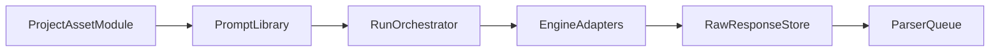

# Phase 2：核心数据采集与评测链路实施说明

<!--
作者：AxeXie
创建时间：2026-05-08 13:08:00
-->

## 1. 阶段目标

打通“项目接入 -> 提示词管理 -> 引擎运行 -> 结构化结果”的主链路，支持一次可复现的 Baseline Run。

## 2. 模块落地清单

### 2.1 项目与资产管理（6.1）

- 项目实体字段：
  - `projectId`
  - `projectType`（website/repository）
  - `brandName`
  - `aliases`
  - `defaultLanguage`
  - `regions`
  - `competitors`
- 资产实体字段：
  - `assetId`
  - `assetType`
  - `sourceUrl`
  - `contentVersion`
  - `lastCrawledAt`
  - `changeSummary`

### 2.2 提示词库（6.2）

- 支持来源：
  - 手动输入
  - CSV 导入
  - 基于资产内容生成
- 支持治理：
  - 标签体系（主题/漏斗阶段/语言/地区/优先级）
  - 去重与 canonical 合并
  - 启停与版本记录

### 2.3 AI 引擎适配器（6.3）

- V1 必须接入不少于 2 个引擎。
- 标准输入：`prompt`、`language`、`region`、`engineConfig`。
- 标准输出：`rawResponse`、`citations`、`status`、`durationMs`、`failureReason`、`responseMeta`。
- 标准能力：限流、重试、缓存、调用日志、敏感信息保护。

### 2.4 Run 编排服务

- 支持 `baseline`、`after`、`scheduled`、`on-demand` 四类任务。
- 支持失败重试与部分成功。
- 支持关联内容版本、Git commit、PR 编号。

## 3. 数据流与边界

## 4. 阶段门禁检查单

- [x] 项目与资产基础模型定义完成
- [x] 提示词库治理规则定义完成
- [x] 引擎输入输出契约定义完成
- [x] Run 编排与重试机制定义完成
- [x] 与统一字典、配置、日志和 i18n 底座完成对齐

## 5. 验收证据要求

- 至少 1 次全链路 Baseline Run 记录。
- 至少 1 次失败重试记录。
- 至少 1 份运行日志可通过 `traceId` 追溯到引擎调用明细。
